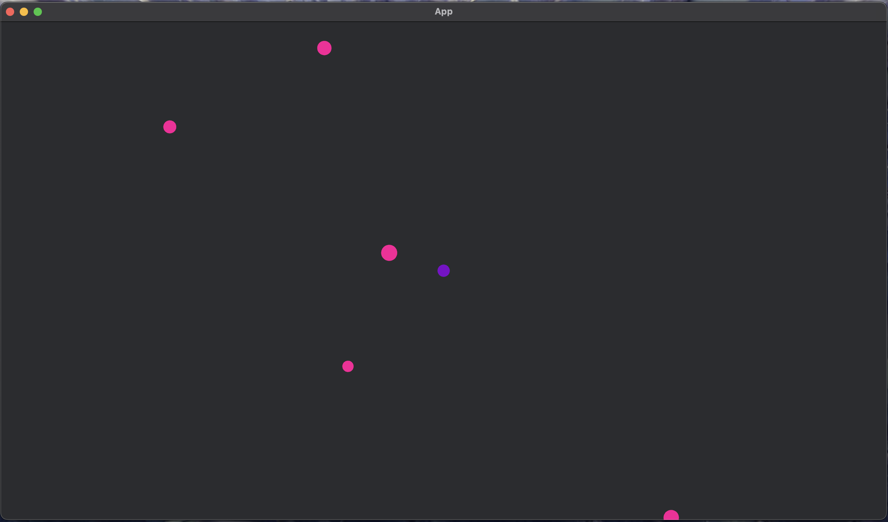

<p align="center">
  ❯ project logo</code>-logo">
</p>
<p align="center">
    <h1 align="center"><code>❯ GRAVITY-GETS-ME</code></h1>
</p>
<p align="center">
    <em>Gravity Gets You Every Time"2. Where Physics Meets Pure Chaos3. Bend the Rules, Break the Law4. Unleash Your Inner Gravity Warrior5. The Force is with YouHowever, my top pick would be:6. Gravity Awaits, Will You Survive?This slogan captures the essence of the projects focus on gravity and physics while also hinting at the challenges and obstacles that players will face in the game. It's concise, memorable, and has a nice ring to it!</em>
</p>
<p align="center">
  <!-- local repository, no metadata badges. --></p>
<p align="center">
    <em>Built with the tools and technologies:</em>
</p>
<p align="center">
  
</p>

<br>

#####  Table of Contents

- [Overview](#overview)
- [Features](#features)
- [Repository Structure](#repository-structure)
- [Modules](#modules)
- [Getting Started](#getting-started)
  - [Prerequisites](#prerequisites)
  - [Installation](#installation)
  - [Usage](#usage)
  - [Tests](#tests)
- [Project Roadmap](#project-roadmap)
- [Contributing](#contributing)
- [License](#license)
- [Acknowledgments](#acknowledgments)

---

##  Overview

The gravity_gets_me package is an open-source game that puts the player on a particle and they must shoot particles that would colide with the player particle. This project uses Bevy, a robust foundation for building complex games. It makes use of features such as customizable text elements, particle (entity) management, and includes a custom gravitational forces calculation. With its scalable design and reusable codebase, gravity_gets_me empowers contributors to create engaging experiences that captivate players.

---

##  Features

|    |   Feature         | Description |
|----|-------------------|---------------------------------------------------------------|
| ⚙️  | **Architecture**  | The project uses a modular architecture with a clear separation of concerns. It has a central hub (`lib` module) that organizes reusable components, resources, and systems. The `src/lib/prelude.rs` file establishes foundational entities for the projects architecture, making them readily available for use throughout the repository. |
| 🔩 | **Code Quality**  | The codebase (mininally) adheres to Rust's coding standards and best practices. It uses a consistent naming convention, and the code is well-structured and readable. The project also employs various tools such as `cargo` to ensure code quality and consistency. |
| 📄 | **Documentation**  | The project has decent documentation, with clear explanations of the architecture and components. However, some parts of the code could benefit from additional comments or documentation to improve understanding. |
| 🔌 | **Integrations**  | The project integrates with various external frameworks, including `bevy`, and `bevy_rapier2d`. These integrations enable the creation of a game engine with physics, shapes, and particle management capabilities. |
| 🧩 | **Modularity**    | The project's modularity is one of its strengths. It has a clear separation of concerns, with each module responsible for a specific aspect of the game engine. This makes it easy to maintain and extend the codebase. |
| 🧪 | **Testing**       | There are no explicit testing frameworks or tools mentioned in the project's documentation. Testing would be beneficial to ensure the code's correctness and stability. |
| ⚡️  | **Performance**   | The project uses various optimization techniques, such as caching and memoization, to improve performance. However, without explicit benchmarking or profiling data, it's difficult to assess the project's overall performance. |
| 🛡️ | **Security**      | The project does not appear to have any specific security measures in place. However, Rust's memory safety features help mitigate potential security risks. Additional security considerations should be taken into account when building or using the game. |
| 📦 | **Dependencies**  | The project depends on various external libraries and frameworks, including `bevy`, `bevy_rapier2d`, and `rand`. These dependencies are managed using `cargo` and `Cargo.toml`. |
| 🚀 | **Scalability**   | The project's modularity and use of reusable components make it relatively easy to scale. However, without explicit benchmarking or profiling data, it's difficult to assess the project's overall scalability. Additional testing and optimization would be beneficial to ensure the code's performance under various loads. |

---

##  Repository Structure

```sh
└── /
    ├── Cargo.lock
    ├── Cargo.toml
    ├── LICENSE.txt
    ├── README.md
    ├── assets
    │   └── fonts
    ├── readme-ai.md
    ├── sample.png
    └── src
        ├── lib
        ├── main.rs
        └── startup.rs
```

---

##  Modules

<details closed><summary>.</summary>

| File | Summary |
| --- | --- |
| [Cargo.toml](Cargo.toml) | Defining project metadata, Cargo.toml specifies essential details about the gravity_gets_me package, including its name, version, edition, and dependencies. It serves as a foundation for the projects architecture and build process. It includes dependencies on the rand crate for random number generation, bevy_rapier2d for 2D physics, and bevy_prototype_lyon for rendering shapes. |
| [LICENSE.txt](LICENSE.txt) | Licensing governs the use and distribution of software components within this repository. The GNU Lesser General Public License version 3 ensures that modifications to the library can be freely used and distributed, while requiring users to provide source code and license information. |

</details>

<details closed><summary>src</summary>

| File | Summary |
| --- | --- |
| [startup.rs](src/startup.rs) | Initializing the game environment involves setting up the camera and spawning the player entity through the `setup` function. The `spawn_player` function creates the players particle with a circle shape and promotes it to a playable character, laying the groundwork for gameplay interactions. |
| [main.rs](src/main.rs) | Initializing the game engine involves setting up resources and plugins for physics, shapes, and particle management. The main function creates an App instance with default resources and plugins, then adds systems to handle startup, game state updates, and custom gravity application. |

</details>

<details closed><summary>src.lib</summary>

| File | Summary |
| --- | --- |
| [mod.rs](src/lib/mod.rs) | Organizing the projects core functionality, the lib module serves as a central hub for reusable components, resources, and systems that power the application. It provides a prelude for easy imports and modularizes the codebase into manageable parts, facilitating maintainability and scalability. |
| [prelude.rs](src/lib/prelude.rs) | Establishing foundational components, Prelude.rs defines essential entities for the projects architecture, including Laser, LaserBundle, Particle, and Player, making them readily available for use throughout the repository, thereby setting the stage for further development and integration. |

</details>

<details closed><summary>src.lib.resources</summary>

| File | Summary |
| --- | --- |
| [game_state.rs](src/lib/resources/game_state.rs) | Managing game state is crucial for a seamless player experience. This file establishes key resources that govern gameplay dynamics, including game mode, particle count, gravitational constant, aiming direction, and game over delay timer, providing a solid foundation for the games architecture. |
| [mod.rs](src/lib/resources/mod.rs) | Defining game state resources is crucial for the repositorys architecture. The `game_state` module in `src/lib/resources/mod.rs` encapsulates essential data and functionality required to manage game state, enabling seamless integration with other components and facilitating efficient development. |

</details>

<details closed><summary>src.lib.components</summary>

| File | Summary |
| --- | --- |
| [window_text.rs](src/lib/components/window_text.rs) | Defining window text components is crucial for rendering dynamic text within application windows. The WindowText struct serves as a building block for creating customizable text elements, enabling developers to easily manage and style text content throughout the applications UI. |
| [mod.rs](src/lib/components/mod.rs) | Laser, particle, and player. These self-contained units enable efficient development and maintenance of complex game logic, aligning with the repositorys modular architecture. |
| [laser.rs](src/lib/components/laser.rs) | Defining Laser ComponentsLaser components are created using Bevys game engine and Bevy Prototype Lyon library. The laser component is designed to render a line with a specified length and color, providing a visual representation for the parent repository's architecture. |
| [particle.rs](src/lib/components/particle.rs) | Particle creation is facilitated through the Particle struct, which encapsulates mass and color properties. The ParticleEntityHyprameters struct aggregates particle data with position and trajectory information. Particle spawning is scheduled using DeferredParticle timestamps, while actual particles are created via spawn_particle function calls. |
| [player.rs](src/lib/components/player.rs) | Promotes entities to player status by inserting the Player component and removing RigidBody components. Swaps player status between two entities, updating their colors and velocities accordingly, while maintaining game physics consistency. Enhances gameplay experience through dynamic entity management. |

</details>

<details closed><summary>src.lib.systems</summary>

| File | Summary |
| --- | --- |
| [particle_keeper.rs](src/lib/systems/particle_keeper.rs) | Replacing Deferred Particles updates entities with actual particles when their scheduled insertion time is reached, removing the DeferredParticle component and spawning new particle entities.Removing Off-Screen Particles despawns particles outside the cameras viewport, adjusting the global particle count to schedule additional particle insertions if necessary. |
| [aim.rs](src/lib/systems/aim.rs) | Update aiming direction based on user input and draw shooting trajectory lines. Handle result of shooting by casting rays and swapping player status with particle entities, adjusting gravity difficulty and global particle count accordingly. |
| [mod.rs](src/lib/systems/mod.rs) | Defining core systems for the game engine is the primary purpose of this module. It organizes various system modules such as aim, game_over, gravity, and particle_keeper under a single namespace, facilitating easy access and management within the repositorys architecture. |
| [gravity.rs](src/lib/systems/gravity.rs) | Calculating gravitational forces between particles is the primary function of this file. It applies custom gravity to non-player particles based on their positions, masses, and sizes, while preventing extreme forces for close proximity. This enhances gameplay realism in the parent repositorys architecture. |
| [game_over.rs](src/lib/systems/game_over.rs) | Displaying game over text is achieved through this system, which checks the current game mode and spawns or despawns the GameOver text accordingly. It also updates a timer and resets various game state variables when the player presses a button to restart the game. |

</details>

---

##  Getting Started

###  Prerequisites

**Rust**: `version x.y.z`

###  Installation

Build the project from source:

1. Clone the  repository:
```sh
❯ git clone .
```

2. Navigate to the project directory:
```sh
❯ cd 
```

3. Install the required dependencies:
```sh
❯ cargo build
```

###  Usage

To run the project, execute the following command:

```sh
❯ cargo run
```

###  Tests

Execute the test suite using the following command:

```sh
❯ cargo test
```

---

##  Project Roadmap

- [X] **`Task 1`**: <strike>Implement feature one.</strike>
- [ ] **`Task 2`**: Implement feature two.
- [ ] **`Task 3`**: Implement feature three.

---

##  Contributing

Contributions are welcome! Here are several ways you can contribute:

- **[Report Issues](https://LOCAL///issues)**: Submit bugs found or log feature requests for the `` project.
- **[Submit Pull Requests](https://LOCAL///blob/main/CONTRIBUTING.md)**: Review open PRs, and submit your own PRs.
- **[Join the Discussions](https://LOCAL///discussions)**: Share your insights, provide feedback, or ask questions.

<details closed>
<summary>Contributing Guidelines</summary>

1. **Fork the Repository**: Start by forking the project repository to your LOCAL account.
2. **Clone Locally**: Clone the forked repository to your local machine using a git client.
   ```sh
   git clone .
   ```
3. **Create a New Branch**: Always work on a new branch, giving it a descriptive name.
   ```sh
   git checkout -b new-feature-x
   ```
4. **Make Your Changes**: Develop and test your changes locally.
5. **Commit Your Changes**: Commit with a clear message describing your updates.
   ```sh
   git commit -m 'Implemented new feature x.'
   ```
6. **Push to LOCAL**: Push the changes to your forked repository.
   ```sh
   git push origin new-feature-x
   ```
7. **Submit a Pull Request**: Create a PR against the original project repository. Clearly describe the changes and their motivations.
8. **Review**: Once your PR is reviewed and approved, it will be merged into the main branch. Congratulations on your contribution!
</details>

<details closed>
<summary>Contributor Graph</summary>
<br>
<p align="left">
   <a href="https://LOCAL{///}graphs/contributors">
      
   </a>
</p>
</details>

---

##  License

This project is protected under the [SELECT-A-LICENSE](https://choosealicense.com/licenses) License. For more details, refer to the [LICENSE](https://choosealicense.com/licenses/) file.

---

##  Acknowledgments

- List any resources, contributors, inspiration, etc. here.

---
